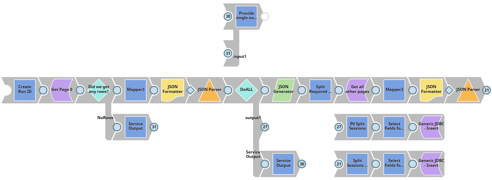
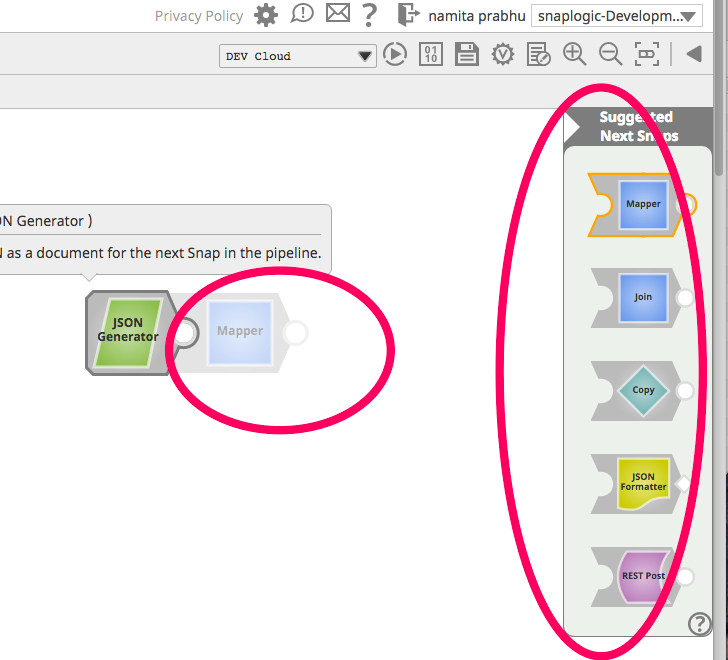
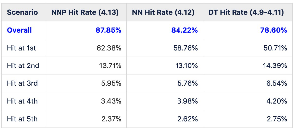

# SnapLogic Snap Recommendation
Recommending the right snap at the right time for SnapLogic users

This workshop studies how to create a recommendation system with tree-based and deep learning model. The dataset contains 25,331 pipelines used internally at [SnapLogic](https://www.snaplogic.com/). Each pipeline contains a series of **snaps**--a block of codes that perform various functions such as data ingestion, manipulation, and even machine learning. No pipeline in this dataset belongs to SnapLogic customers. 

SnapLogic is one of the world's leading data integration companies based in San Mateo, CA. They provide excellent [machine learning use cases](https://docs-snaplogic.atlassian.net/wiki/spaces/SD/pages/474677262/Machine%2BLearning%2BUse%2BCases) using their platform in [this repository](https://github.com/JumpThanawut/SnapLogic-Data-Science).

The objective of the recommendation system is to suggest the most likely snaps that the user will choose next given their current pipeline. You can think of it as when you type something into your cellphone and it recommends you the next word.

Performance is evaluated by top-5 accuracy:

In this workshop, we provide `model_tree.ipynb` as tutorial for tree-based models and `model_deep.ipynb` for deep learning model similar to the paper [Deep Neural Networks for YouTube Recommendations](https://static.googleusercontent.com/media/research.google.com/en//pubs/archive/45530.pdf).

## Collaborators
* [JumpThanawut](https://github.com/orgs/Datatouille/people/JumpThanawut) for sharing and preparing the dataset, as well as authoring tree-based models
* [witchapong](https://github.com/witchapong) for authoring deep learning models
* [cstorm125](https://github.com/cstorm125) for editing tree-based and deep learning model notebooks